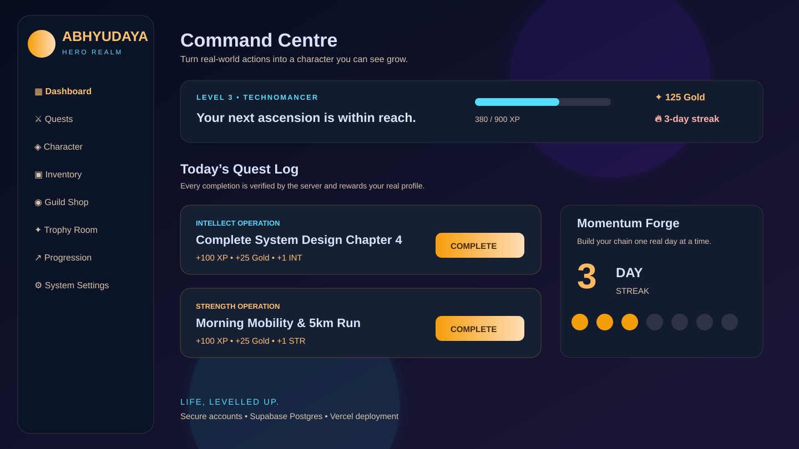
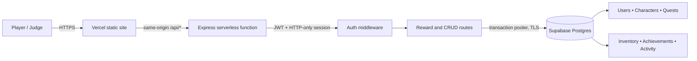
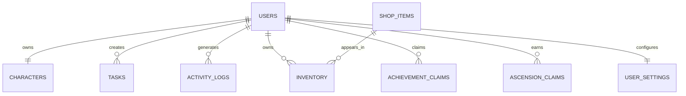

# Abhyudaya — Life, Levelled Up

> A full-stack Life RPG that turns real-world habits into quests, character growth, streaks, achievements, and rewards.

[Live demo](https://abhyudaya-red.vercel.app) · [API health](https://abhyudaya-red.vercel.app/api/health) · [Architecture](#architecture) · [Feature tour](#feature-tour)



## Why Abhyudaya?

Normal productivity apps delay the reward. Abhyudaya closes that feedback loop: a completed workout, study block, or focused task gives immediate XP, Gold, a linked attribute increase, streak progression, an in-world celebration, and a durable record in the player’s account.

## Feature tour

| Screen | What it does | Connected system |
| --- | --- | --- |
| Landing & auth | Explains the Life RPG premise, then creates or signs into a protected account. | Password hashing, JWT session |
| Onboarding | Builds a player identity: archetype, origin, directives, protocol, and six attributes. | Character persistence and starter quest creation |
| Dashboard | Shows the current character state, active quests, XP, Gold, streak, notifications, and story rewards. | Live user-scoped API data |
| Quest Log | Create, edit, delete, and complete real-world quests. | Transactional CRUD and reward engine |
| Character & progression | Presents attributes, level path, origin, and ascension state. | Non-linear level system |
| Trophy Room | Tracks unlock conditions and allows a reward to be claimed once. | Achievement claims |
| Guild Shop & inventory | Buy, equip, use, or disenchant earned virtual items. | Gold economy and inventory ownership |
| Activity & notifications | Shows immutable account activity and recent realm events. | Activity log |
| System settings | Theme, sound, motion, export, rebirth, API-key and account controls. | Persistent user settings / account lifecycle |

### Reward loop

1. Create a quest and choose its attribute.
2. Complete it from the Quest Log or Dashboard.
3. The server verifies it has not already been completed.
4. One database transaction awards XP, Gold, `+1` to the linked attribute, an updated streak, and any level-up record.
5. The interface reacts immediately with animation, sound (when enabled), a story moment, and live stats.

## Architecture



### Data model



## Technical decisions

- **Frontend:** semantic HTML, responsive CSS/Tailwind utilities, vanilla JavaScript, accessible keyboard controls, mobile bottom navigation.
- **Backend:** Express API hosted as a Vercel Node function.
- **Database:** Supabase Postgres through the serverless Transaction Pooler; no browser-side database credentials.
- **Security:** bcrypt password hashing, JWT sessions in HTTP-only cookies, bearer fallback for same-origin UI requests, user-scoped database queries, and server-side reward calculation.
- **Atomic progression:** completion, Gold, XP, stat, streak, level, and activity updates happen in one Postgres transaction.
- **Deployment:** Vercel serves `public/`; all nested `/api/*` routes are rewritten to the Express handler. Supabase retains data across Vercel instances.

## Project structure

```text
.
├── public/                 # Landing, auth, onboarding and in-app screens
├── api/index.js            # Vercel function entrypoint
├── server.js               # Express API and progression engine
├── supabase/schema.sql     # Cloud Postgres schema and seed shop items
├── docs/screenshots/       # Repository visuals for GitHub
├── vercel.json             # /api/* routing configuration
└── README.md
```

## Run locally

1. Copy `.env.example` to `.env` and set a long, unique `JWT_SECRET`.
2. Run `npm install`.
3. Run `npm start` and open `http://localhost:3000`.

Do not open the HTML files directly when using the application features: authentication and the API require the local server.

## Implemented systems

- Password-hashed account registration, login, logout, and HTTP-only JWT sessions
- SQLite-backed users, characters, onboarding choices, quests, immutable task history, shop inventory, ascension claims, achievement claims, and activity logs
- User-scoped API authorization for every protected record
- Create, list, edit, delete, and complete quests
- Server-side, transactional XP, gold, attribute, streak, and level updates
- Non-linear level thresholds (`100 × level²` XP) and immutable completion records
- Server-enforced shop purchases, inventory ownership, equipping, consuming, and salvaging
- Claimable achievement bounties and server-validated ascension allocations
- Persistent sound/motion preferences, live XP telemetry, and exportable activity data

The three ascension celebration variants remain available as `levelup.html`, `levelup-2.html`, and `levelup-3.html`.

## Public deployment for judges

This is a same-origin Express application: deploy the pages and `/api/*` backend together. Deploying only the HTML as a static site will break login and real-time progression.

### Fast free judge preview (Render)

1. Push this `lifequest` folder to a GitHub repository. Never commit `.env` or `lifequest.db`.
2. In Render select **New → Web Service**, connect the repository, and set:
   - Build command: `npm install`
   - Start command: `npm start`
   - Environment: `NODE_ENV=production`
   - Secret: `JWT_SECRET` set to a long random value (for example, `openssl rand -hex 32`).
3. Share the resulting `https://…onrender.com` address. First open `/api/health` and confirm it returns `status: ok`.

### Vercel + Supabase production deployment

The app now runs on Supabase Postgres, not a local SQLite file. In Supabase SQL Editor, run `supabase/schema.sql` once. In Vercel, add `DATABASE_URL` from **Supabase → Connect → Transaction pooler** (port 6543), `JWT_SECRET`, and `NODE_ENV=production` for Production and Preview. URL-encode special characters inside the password before inserting it in `DATABASE_URL` (`@` becomes `%40`, `#` becomes `%23`, `?` becomes `%3F`). Do not set `DATABASE_PATH`, and do not expose the database URL, database password, or service-role key in browser code.

Vercel serves the app from `public/` and runs `api/[...path].js` for every `/api/*` route. The Postgres client is configured for serverless transaction pooling: one connection, TLS, and prepared statements disabled.
